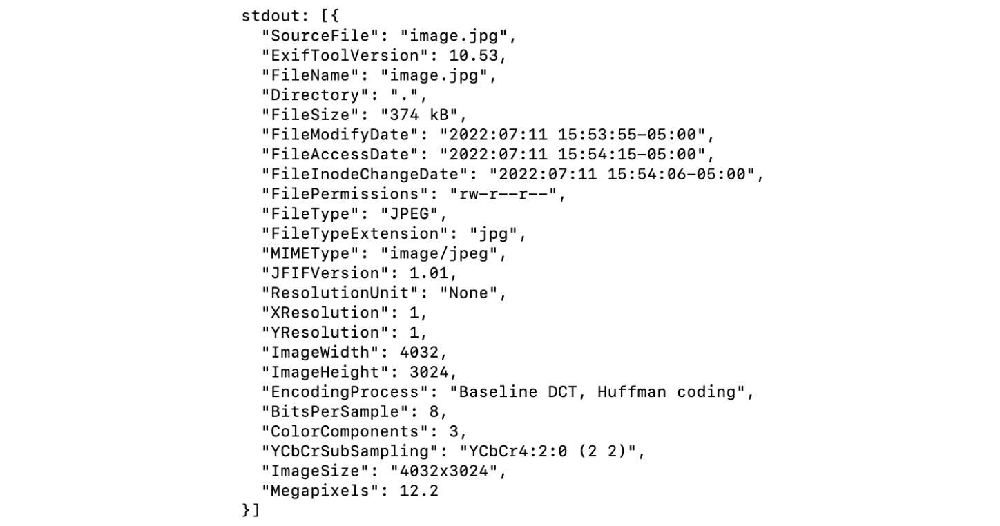

# Trash Tracker SMS

[](https://opensource.org/licenses/MIT)

## Table of Contents
- [Description](#description)
- [Installation](#installation)
- [Usage](#usage)
- [Local Development](#local-development)
- [Other Usages](#other-usages)
- [Credits](#credits)
- [License](#license)

## Description

Trash Tracker is a simple, lightweight system that allows residents and staff of the Lykins neighborhood to report illegal dumping with a simple text message. This app records the reporting messages.

## Installation
1. Install dependencies

    ```bash
    npm install -g yarn && \
    yarn install
    ```

2. Copy the sample configuration file and edit it to match your configuration

   ```bash
   $ cp .env.EXAMPLE .env
   ```
   You can find your `TWILIO_ACCOUNT_SID` and `TWILIO_AUTH_TOKEN` in your [Twilio Account Settings](https://www.twilio.com/console).

## Usage
To run the application, enter:

    ```bash
    $ node ./routes/flow.js
    ```

Any users can send a text message to our Twilio phone number (816) 608-6096 and start the conversation! The following photo shows an example:


After the conversation is complete, you can see the object, location, and reporting number logged in the command line.


To extract exif data from existing images, add image path and name to [extract-exif.js](./extract-exif.js), and run the following command:

```bash
$ node extract-exif.js
```

You will see geolocation data in the command line:



## Local Development

You will need a webhook url on the public Internet. To do that, you need to install [ngrok](https://ngrok.com/download) to expose your local network to the public Internet. After you install it and configure the authentification, open a second terminal and enter the following command:

```bash
$ ngrok http 1337
```

Once you acquire a forwarding url from ngrok, copy and paste it in http_request_english and http_request_spanish widgets in your Twilio Studio flow. You will need to update the url everytime you run that script. The below photo shows an example.


## Other Usages

If you want to design your own app without using Twilio flow, here are some resources: 
1. To initiate or send a custom message, enter:
    ```bash
    $ node ./mms-send.js
    ```
2. To fetch a message sent to your Twilio number, enter:
    ```bash
    $ node ./mms-fetch.js
    ```
3. To set up an auto-generated reply to messages sent to your Twilio number, enter: 
    ```bash
    $ node ./routes/sms.js
    ```
4. To send an image to your webhook url, enter the following command and go to [http://localhost:1337/](http://localhost:1337/) to see the images received.

    ```bash
    $ yarn start
    ```

## Credits
Twilio documentations have been tremendous help for this project, especially the ones on [Programmable SMS](https://www.twilio.com/docs/sms/quickstart/node#sign-up-for-twilio-and-get-a-twilio-phone-number) and on [Twilio Studio](https://www.twilio.com/docs/studio/user-guide/get-started). The 4th usage of "other usages" of this repository uses almost all code from the Twilio repository [receive-mms-node](https://github.com/TwilioDevEd/receive-mms-node).

## License

[MIT](https://opensource.org/licenses/MIT)
