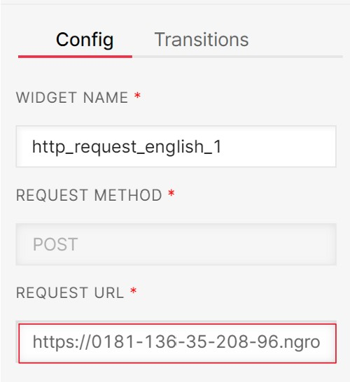

# TrashTrackerSMS

[](https://opensource.org/licenses/MIT)

## Description

Trash Tracker is a simple, lightweight system that allows residents and staff of the Lykins neighborhood to report illegal dumping with a simple text message.

## Prerequisites

- [A Twilio account](http://www.twilio.com/referral/7fB3Je)
- [A Twilio phone number](https://www.twilio.com/docs/usage/tutorials/how-to-use-your-free-trial-account#get-your-first-twilio-phone-number)

## Installation

To import our Twilio Studio flow, go to your Twilio studio and create a new flow. Select **Import from JSON** from the list of templates. In the next window, you can paste the Flow JSON from [twilio.json](./twilio.json).

Next, click on the Trigger Widget on the top and copy your webhook url from the Inspector Panel on the right hand. It should look like this:

```
https://webhooks.twilio.com/v1/Accounts/{AccountSid}/Flows/{FlowSid}
```

Navigate to the [Active Numbers section of the Twilio Console](https://www.twilio.com/console/phone-numbers/incoming) and click on the number you’d like to connect to the Flow. Go to the **Messaging section** and paste your webhook url under **A Message Comes In**.

Here is what the place looks like:


## Usage

Any users can send a text message to your Twilio phone number and start the conversation! The following photo shows an example:


## Local Testing

To test local files, you need a webhook url on the public Internet. To do that, you need to install [ngrok](https://ngrok.com/download) to expose your local network to the public Internet. After you install it and configure the authentification, enter the following command in your terminal:

```bash
$ ngrok http 1337
```

Once you acquire a forwarding url from ngrok, copy and paste it in Twilio Console > Phone Numbers > Manage > Active Numbers > Configure > Messaging > A Message Comes In. If you are testing the http connection with Twilio Studio, paste it in http_request_english and http_request_spanish widgets in your Twilio Studio flow instead. You will need to update the url everytime you run that script. The below photo shows an example.



## License

[MIT](https://opensource.org/licenses/MIT)
